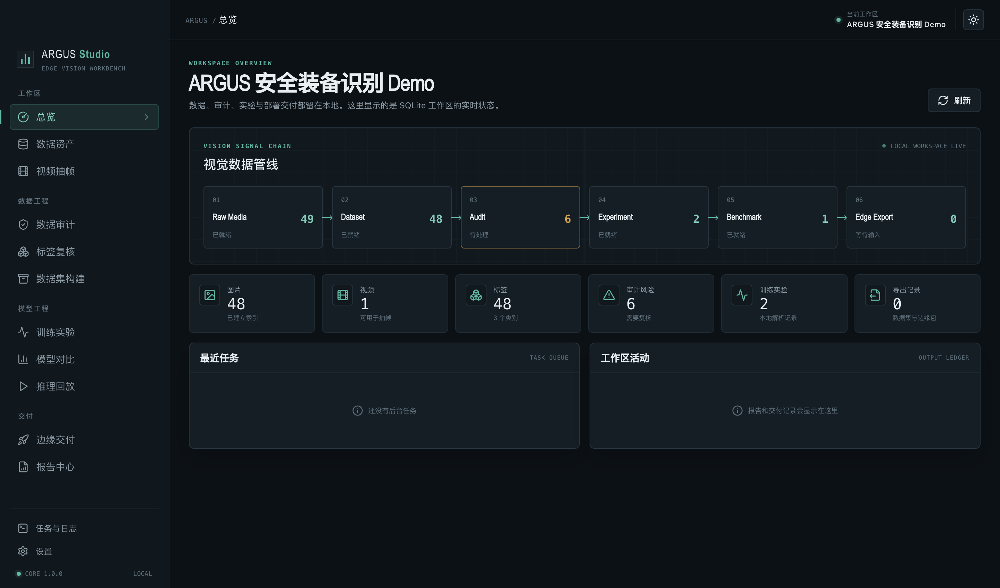
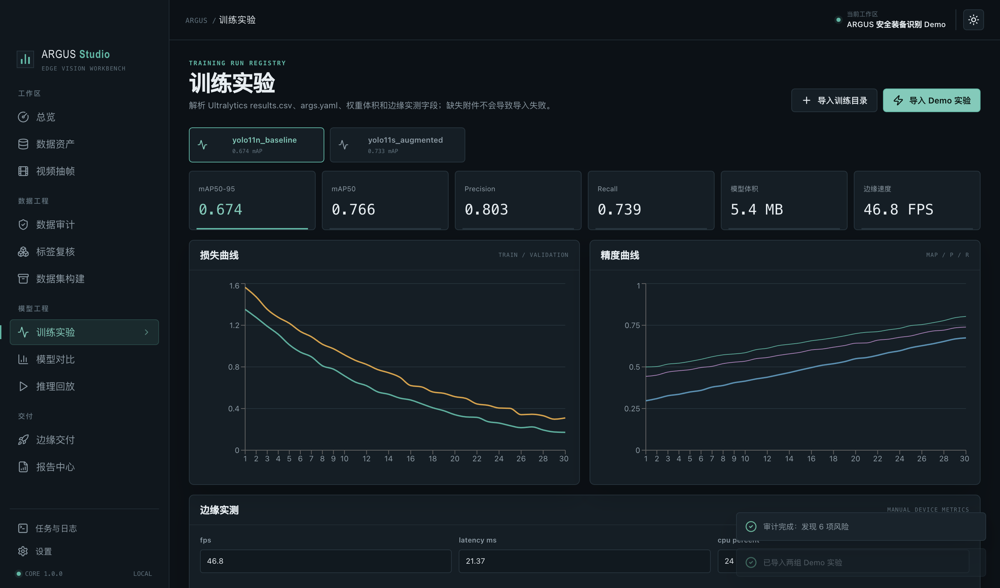
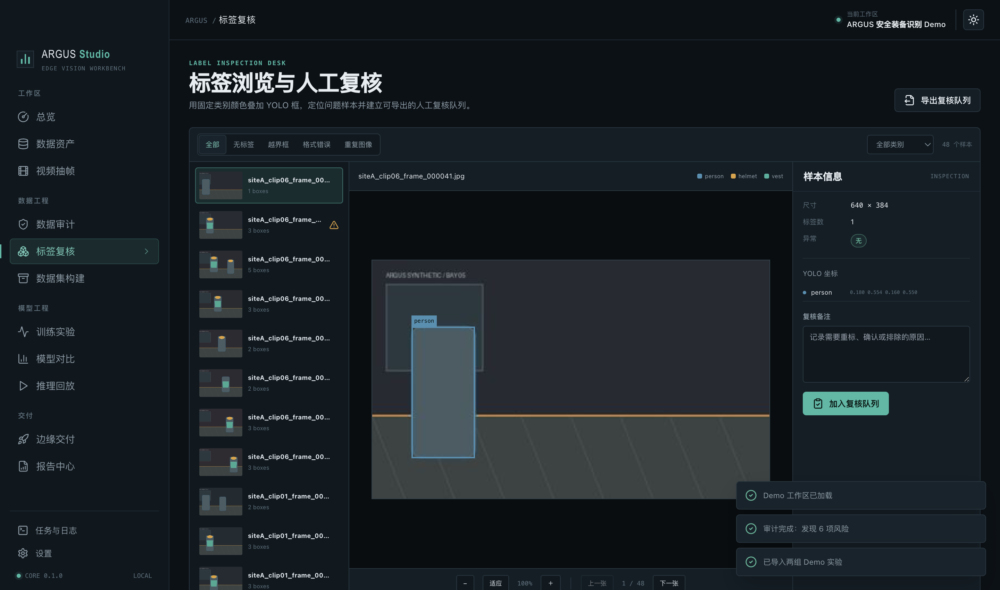

# ARGUS Studio

**An offline-first edge vision engineering workbench for macOS.**

[](../../actions/workflows/ci.yml)
[](LICENSE)
[](docs/DEVELOPMENT.md)

ARGUS Studio turns scattered computer-vision tasks into one local, auditable workflow: inspect YOLO datasets, review labels, compare training runs, replay predictions, and prepare RDK X5/Linux delivery packages. It is built with Electron, React, TypeScript, FastAPI, SQLite, OpenCV, and PyInstaller.

> 中文说明：[README_zh.md](README_zh.md)



## Highlights

- **Local-first:** project data, indexes, reports, and review decisions remain on your Mac.
- **YOLO quality gate:** inspect missing labels, invalid classes, malformed or out-of-bounds boxes, duplicate images, split leakage, class balance, and `dataset.yaml`.
- **Review desk:** browse fixed-color overlays, filter risky samples, add notes, and export a review queue.
- **Experiment registry:** parse Ultralytics-style `results.csv` and `args.yaml`, chart curves, and attach edge-device measurements.
- **Explainable benchmark:** compare accuracy, speed, latency, model size, power, and temperature with documented weights.
- **Prediction playback:** review precomputed TP/FP/FN and low-confidence cases without requiring a training stack.
- **Edge handoff:** generate RDK X5/Linux configuration templates, manifests, reports, and ZIP packages.
- **Synthetic demo:** 48 generated images, YOLO labels, a short video, two training runs, and prediction JSON—no downloaded media or model weights.

## Screenshots

| Experiment curves | Label inspection |
|---|---|
|  |  |

## Install the macOS release

ARGUS Studio v0.1.0 supports **Apple Silicon** Macs running **macOS 13 Ventura or later**.

1. Open the [latest GitHub Release](../../releases/latest).
2. Download `ARGUS-Studio-0.1.0-macOS.dmg` and its `.sha256` file.
3. Verify the download:

   ```bash
   shasum -a 256 -c ARGUS-Studio-0.1.0-macOS.dmg.sha256
   ```

4. Open the DMG and drag **ARGUS Studio** to **Applications**.
5. Because v0.1.0 is ad-hoc signed and not notarized, the first launch may require Finder → right-click **ARGUS Studio** → **Open**.

The packaged app includes its Python sidecar and demo. End users do not need Python, Node.js, CUDA, or an NVIDIA GPU.

## Run from source

Prerequisites:

- macOS 13+
- Python 3.11 or 3.12
- Node.js 22.13 or later with pnpm/Corepack

```bash
git clone <your-fork-url>
cd argus-studio
./setup_dev.command
./run_dev.command
```

On the welcome screen, select **加载内置 Demo**. The setup script creates only `.venv`, `node_modules`, and generated local caches inside the project.

## Verify and build

```bash
.venv/bin/pytest
pnpm run typecheck
pnpm run lint
pnpm test
pnpm run build
./build_macos.command
```

`build_macos.command` runs tests, freezes the FastAPI sidecar, and produces an arm64 `.app`, `.dmg`, and `.zip` under the ignored `dist/` directory.

## Architecture

```text
React renderer (sandboxed, no Node integration)
        │ typed contextBridge IPC
        ▼
Electron main process
        │ 127.0.0.1:<random port> + per-launch token
        ▼
FastAPI sidecar ── SQLite / Pillow / OpenCV / NumPy / Pandas
```

The sidecar listens only on loopback. Electron generates a 256-bit token for each launch. Renderer IPC calls are restricted to the active application window, and the page ships with a restrictive Content Security Policy.

## Scope and limitations

v0.1.0 is a practical engineering workbench, not a model trainer or a remote fleet manager.

- It does not train models or bundle Ultralytics.
- Prediction playback uses imported or bundled precomputed JSON.
- RDK output is a delivery template; it does not claim to run quantization, BPU compilation, flashing, or remote device control.
- The release is arm64-only, ad-hoc signed, and not Apple-notarized.
- No telemetry, cloud account, paid API, or automatic update service is included.

## Documentation

- [Development guide](docs/DEVELOPMENT.md)
- [Architecture](docs/ARCHITECTURE.md)
- [Local API](docs/API.md)
- [Demo guide](docs/DEMO.md)
- [Security review](docs/SECURITY.md)
- [Open-source release process](docs/OPEN_SOURCE_RELEASE.md)
- [Roadmap](docs/ROADMAP.md)
- [Third-party notices](docs/THIRD_PARTY_NOTICES.md)

## Contributing

Bug reports, documentation fixes, test cases, and focused pull requests are welcome. Read [CONTRIBUTING.md](CONTRIBUTING.md), follow the [Code of Conduct](CODE_OF_CONDUCT.md), and report vulnerabilities through [SECURITY.md](SECURITY.md).

## License

ARGUS Studio source code is released under the [MIT License](LICENSE). Third-party software remains under its respective license; see [Third-Party Notices](docs/THIRD_PARTY_NOTICES.md).
